# RoomReserve — Office Meeting Room Booking System

A full-stack MERN application for managing and booking office meeting rooms, with role-based dashboards, live availability, conflict-free scheduling and analytics.

**Author:** Rohan Kumar

---

## Table of Contents

- [Overview](#overview)
- [Features](#features)
- [Screenshots](#screenshots)
- [Tech Stack](#tech-stack)
- [Project Structure](#project-structure)
- [Getting Started](#getting-started)
- [Environment Variables](#environment-variables)
- [Demo Accounts](#demo-accounts)
- [API Reference](#api-reference)
- [Booking Rules](#booking-rules)
- [Security](#security)
- [Deployment](#deployment)
- [Scripts](#scripts)
- [Troubleshooting](#troubleshooting)
- [License](#license)

---

## Overview

RoomReserve replaces the shared-calendar-and-group-chat way of booking a room. Employees can see every room's live schedule, filter by capacity and amenities, and claim a slot instantly. Administrators get usage analytics, employee management and full control over the room inventory.

The app is split into two independently runnable packages:

| Folder  | Role            | Stack                    | Default port |
| ------- | --------------- | ------------------------ | ------------ |
| `client` | React front end  | Vite + React 18 + Tailwind | 5173       |
| `server` | Express REST API | Node.js + Express + MongoDB | 5000     |

---

## Features

### For employees

- **Register and sign in** with work email and a validated password
- **Browse rooms** with image, capacity, floor, location and amenity details
- **Live availability** — see each room's booked slots for any date before choosing
- **Conflict-free booking** — overlapping reservations are rejected automatically
- **Filter** rooms by capacity, floor and required amenities
- **My Bookings** — view, edit and cancel your own reservations
- **Profile photo upload** (optional, at sign-up or later) stored on Cloudinary
- **Light and dark themes**, remembered between visits

### For administrators

- **Dashboard** with occupancy stats and today's bookings
- **Analytics** — booking trends, top rooms, status breakdown and peak hours
- **Manage rooms** — create, edit, activate/deactivate and delete
- **Room photo upload** via Multer + Cloudinary
- **All Bookings** — view and edit *any* employee's booking
- **Employee management** — search, filter by status, activate/deactivate accounts
- **Book rooms themselves** and keep a personal booking history

### Platform

- **Automatic booking completion** — a cron job closes past bookings every 5 minutes and frees their slots
- **Responsive** layout that works on mobile, tablet and desktop
- **Centralised validation** with Joi on the server and react-hook-form on the client
- **Rate limiting**, security headers, CORS and hashed passwords

---

## Screenshots

| Sign in | Admin overview |
| --- | --- |
| 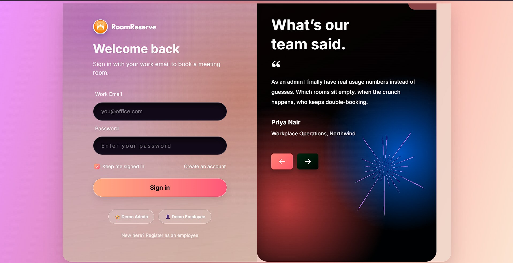 | 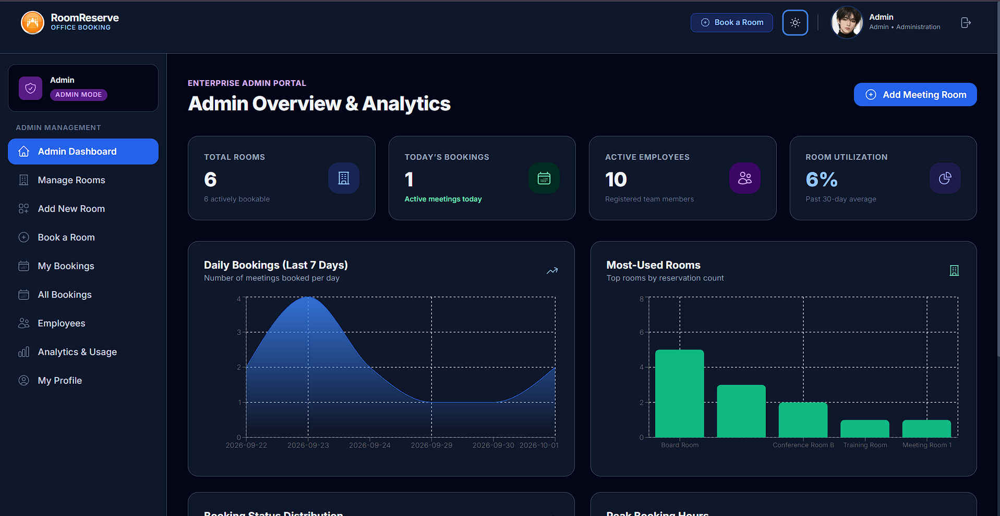 |

| Employee management | All bookings |
| --- | --- |
| 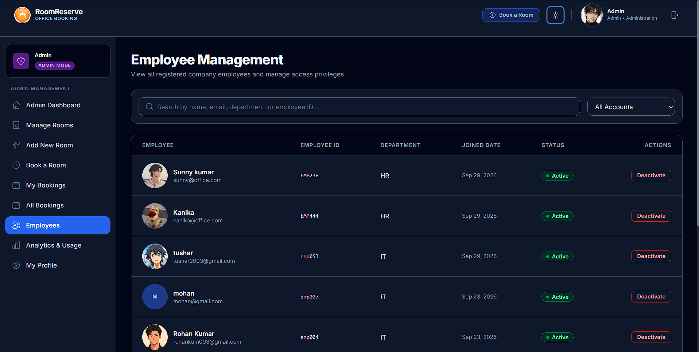 | 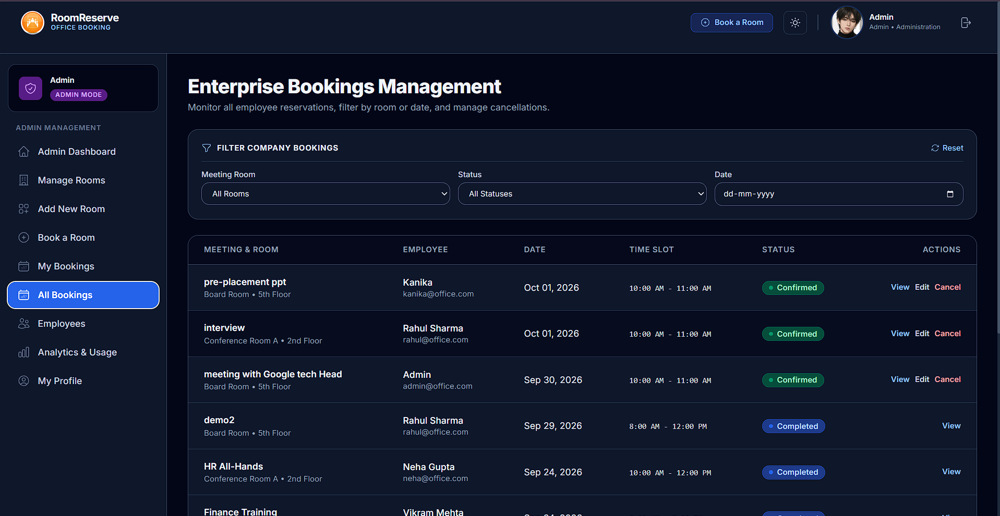 |

| Employee dashboard | Meeting rooms |
| --- | --- |
| 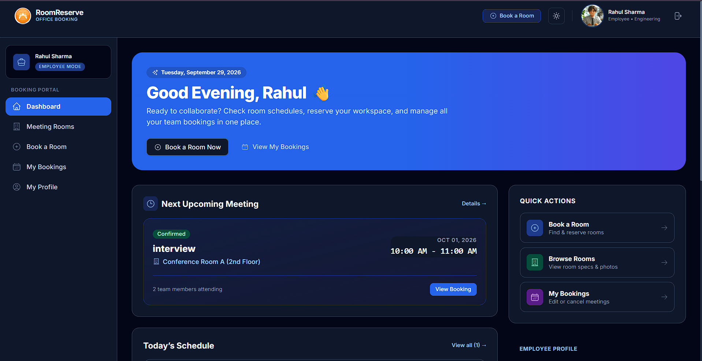 | 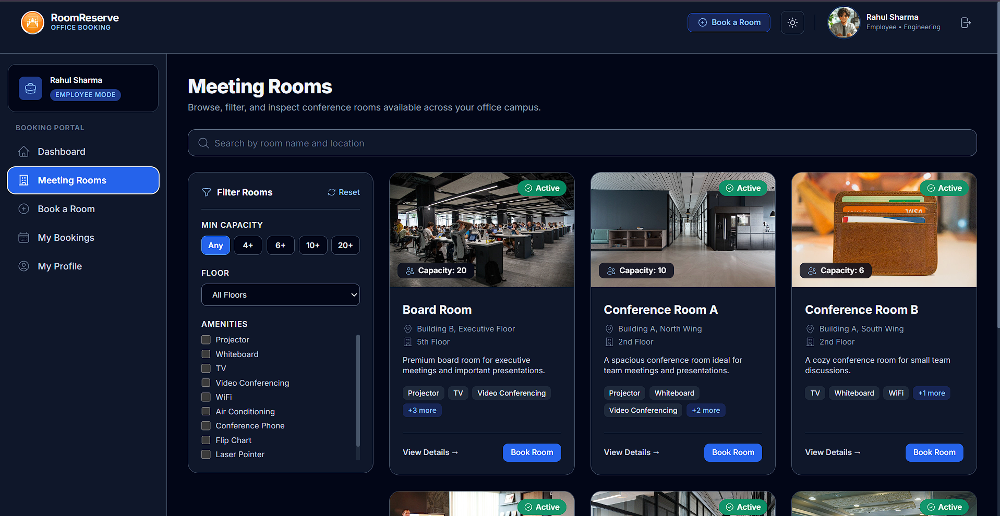 |

| Book a room | My bookings |
| --- | --- |
| 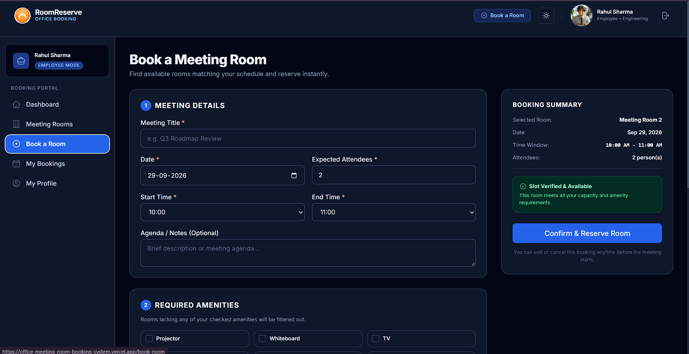 | 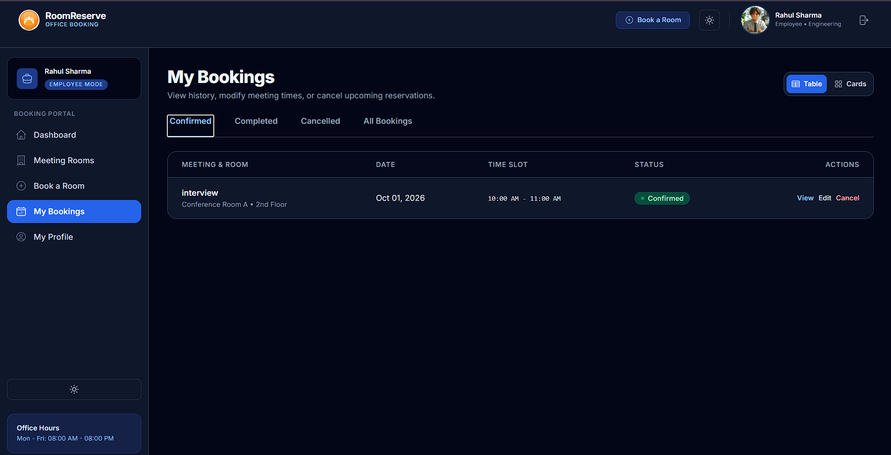 |

| Profile | Register |
| --- | --- |
| 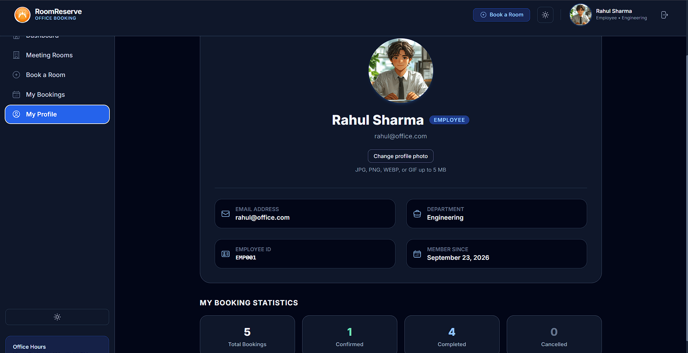 | 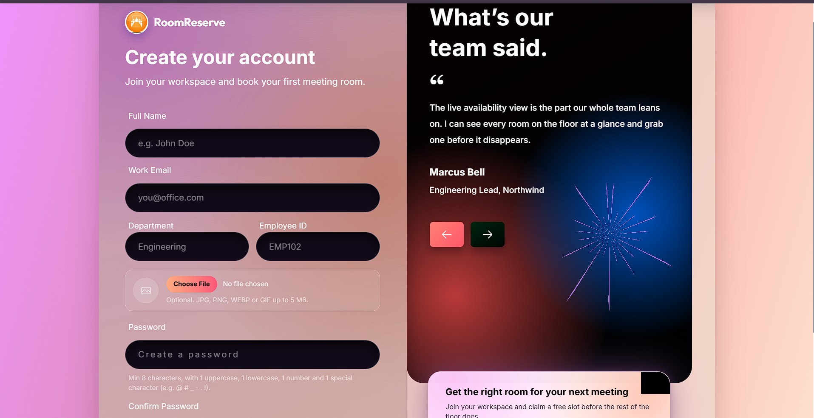 |

| Analytics |
| --- |
| 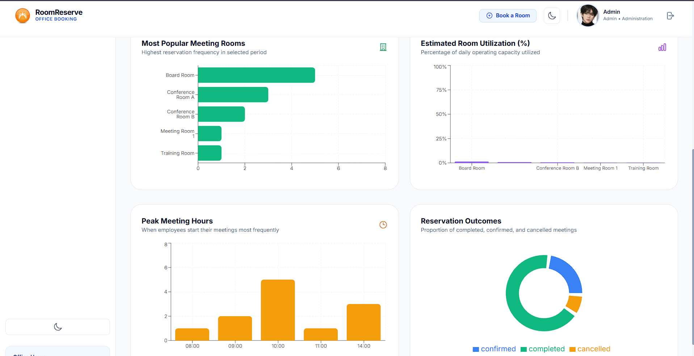 |
## Tech Stack

**Front end**

| Package            | Version | Purpose                          |
| ------------------ | ------- | -------------------------------- |
| React              | 18.2    | UI library                       |
| Vite               | 5.x     | Build tool and dev server        |
| Tailwind CSS       | 3.4     | Utility-first styling            |
| React Router       | 6.x     | Client-side routing              |
| react-hook-form    | 7.x     | Form state and validation        |
| Axios              | 1.x     | HTTP client with interceptors    |
| Recharts           | 2.x     | Charts for the analytics page    |
| date-fns           | 3.x     | Date formatting                  |
| @heroicons/react   | 2.x     | Icon set                         |
| react-hot-toast    | 2.x     | Notifications                    |
| ESLint             | 8.x     | Linting                          |

**Back end**

| Package            | Version | Purpose                          |
| ------------------ | ------- | -------------------------------- |
| Node.js            | 20+     | Runtime                          |
| Express            | 4.x     | REST framework                   |
| MongoDB + Mongoose | 8.x     | Database and ODM                 |
| Joi                | 17.x    | Request validation               |
| jsonwebtoken       | 9.x     | JWT signing                      |
| bcryptjs           | 2.x     | Password hashing                 |
| cookie-parser      | 1.x     | Cookie parsing                   |
| helmet             | 7.x     | Security headers                 |
| cors               | 2.x     | Cross-origin requests            |
| morgan             | 1.x     | HTTP request logging             |
| express-rate-limit | 7.x     | Rate limiting                    |
| multer             | 2.x     | Multipart file handling          |
| cloudinary         | 2.x     | Image storage and delivery       |
| node-cron          | 4.x     | Scheduled background jobs        |

---

## Project Structure

```
.
├── client/
│   ├── public/                 # Static assets served at the site root
│   ├── src/
│   │   ├── components/
│   │   │   ├── auth/           # Shared login/register chrome
│   │   │   ├── bookings/       # Calendar, table, cards, edit modal
│   │   │   ├── common/         # Button, Input, Modal, Pagination…
│   │   │   └── rooms/          # Room card, grid, filters
│   │   ├── constants/          # Marketing copy and brand assets
│   │   ├── context/            # AuthContext, ThemeContext
│   │   ├── hooks/              # useAuth
│   │   ├── layouts/            # MainLayout, Navbar, Sidebar
│   │   ├── pages/
│   │   │   ├── admin/          # Admin dashboards and CRUD
│   │   │   ├── auth/           # Login, Register
│   │   │   └── employee/       # Employee dashboards and pages
│   │   ├── routes/             # ProtectedRoute, AdminRoute, PublicRoute
│   │   ├── services/           # Axios API layer
│   │   ├── styles/             # Auth screen stylesheet
│   │   └── utils/              # Constants and formatters
│   ├── .eslintrc.cjs
│   ├── tailwind.config.js
│   └── vite.config.js
│
├── server/
│   ├── public/uploads/         # Temporary Multer files (git-ignored)
│   ├── scripts/seed.js         # Demo data
│   ├── src/
│   │   ├── config/             # Shared constants
│   │   ├── controllers/        # Request handlers
│   │   ├── jobs/               # Cron jobs
│   │   ├── middleware/         # Auth, validation, uploads, rate limits, errors
│   │   ├── models/             # Mongoose schemas
│   │   ├── routes/             # Express routers
│   │   ├── services/           # Business logic
│   │   ├── utils/              # ApiError, ApiResponse, Cloudinary
│   │   ├── validators/         # Joi schemas
│   │   ├── app.js              # Express app assembly
│   │   └── server.js           # Entry point
│   └── .env.example
└── README.md
```

---

## Getting Started

### Prerequisites

- **Node.js 20 or newer** (developed on v24)
- **npm 10 or newer**
- **MongoDB 6+** running locally, or a free MongoDB Atlas cluster

### 1. Clone the repository

```bash
git clone https://github.com/Rohakumar12/Office-meeting-room-booking-system.git
cd Office-meeting-room-booking-system
```

### 2. Configure the server

```bash
cd server
npm install
cp .env.example .env
```

Edit `server/.env` and set at minimum:

```env
MONGODB_URI=mongodb://localhost:27017/meeting-room-booking
JWT_SECRET=replace_this_with_a_long_random_string
CLIENT_URL=http://localhost:5173
```

Cloudinary keys are only required if you want image uploads to work.

### 3. Seed demo data (optional but recommended)

```bash
npm run seed
```

This creates **6 rooms**, **6 users** (1 admin, 5 employees) and **8 sample bookings**.

### 4. Start the server

```bash
npm run dev
```

The API runs on <http://localhost:5000>. Verify it with:

```bash
curl http://localhost:5000/health
```

### 5. Configure and start the client

In a **second terminal**:

```bash
cd client
npm install
cp .env.example .env
```

`client/.env`:

```env
VITE_API_URL=/api
```

Then:

```bash
npm run dev
```

The app runs on <http://localhost:5173>.

### 6. Sign in

Use one of the demo accounts below, or register a new employee account through the UI.

---

## Environment Variables

### `server/.env`

| Variable                         | Required | Default                 | Description                                  |
| -------------------------------- | -------- | ----------------------- | -------------------------------------------- |
| `PORT`                           | No       | `5000`                  | API port                                     |
| `MONGODB_URI`                    | **Yes**  | —                       | MongoDB connection string                    |
| `JWT_SECRET`                     | **Yes**  | —                       | Secret used to sign access tokens            |
| `JWT_EXPIRE`                     | No       | `15m`                   | Access token lifetime (`s`/`m`/`h`/`d`)      |
| `REFRESH_TOKEN_TTL_DAYS`         | No       | `7`                     | Refresh token lifetime, in days              |
| `CLIENT_URL`                     | **Yes**  | `http://localhost:5173` | Allowed CORS origin (no trailing slash)      |
| `NODE_ENV`                       | No       | `development`           | Set to `production` on your host             |
| `BCRYPT_ROUNDS`                  | No       | `12`                    | Password hashing cost                        |
| `CLOUDINARY_CLOUD_NAME`          | For uploads | —                    | Cloudinary cloud name                        |
| `CLOUDINARY_API_KEY`             | For uploads | —                    | Cloudinary API key                           |
| `CLOUDINARY_API_SECRET`          | For uploads | —                    | Cloudinary API secret                        |
| `CLOUDINARY_FOLDER`              | No       | `roomreserve`           | Folder used in Cloudinary                    |

**Rate limiting** (all optional — sensible defaults are built in)

| Variable                        | Default | Description                                  |
| ------------------------------- | ------- | -------------------------------------------- |
| `RATE_LIMIT_WINDOW_MS`          | `900000`| General API window (15 min)                  |
| `RATE_LIMIT_MAX`                | `300`   | General API requests per IP                   |
| `AUTH_RATE_LIMIT_WINDOW_MS`     | `900000`| Auth window (15 min)                          |
| `AUTH_RATE_LIMIT_MAX`           | `20`    | Failed auth attempts per IP                   |
| `AUTH_ACCOUNT_LIMIT_WINDOW_MS`  | `900000`| Per-account window (15 min)                   |
| `AUTH_ACCOUNT_LIMIT_MAX`        | `10`    | Failed auth attempts per email                |
| `UPLOAD_RATE_LIMIT_WINDOW_MS`   | `3600000`| Upload window (60 min)                        |
| `UPLOAD_RATE_LIMIT_MAX`         | `20`    | Image uploads per IP                          |

### `client/.env`

| Variable         | Default | Description                                             |
| ---------------- | ------- | ------------------------------------------------------- |
| `VITE_API_URL`   | `/api`  | API base URL. Use the full deployed URL in production   |

---

## Demo Accounts

Created by `npm run seed`:

| Role     | Email                | Password       |
| -------- | -------------------- | -------------- |
| Admin    | `admin@office.com`   | `Admin@123`    |
| Employee | `rahul@office.com`   | `Employee@123` |

The seed also creates `priya@`, `arjun@`, `neha@` and `vikram@office.com`, all with the password `Employee@123`.

The login page also has **Quick Demo Login** buttons that fill these credentials for you.

---

## API Reference

Base URL: `http://localhost:5000/api`

All responses follow the shape:

```json
{ "success": true, "message": "...", "data": { } }
```

Authentication uses **two httpOnly cookies**, so browser requests must send credentials (`withCredentials`).

| Cookie         | Lifetime | Path          | Contents                                  |
| -------------- | -------- | ------------- | ----------------------------------------- |
| `accessToken`  | 15 min   | `/`           | Short-lived signed JWT for API calls      |
| `refreshToken` | 7 days   | `/api/auth`   | Opaque random secret, stored **hashed**   |

The refresh cookie is scoped to `/api/auth`, so the browser does not attach it to ordinary API calls. It is the only credential that can mint a new access token.

### Auth — `/api/auth`

| Method | Endpoint   | Access  | Description                                          |
| ------ | ---------- | ------- | ---------------------------------------------------- |
| `POST` | `/register`| Public  | Create an employee account                           |
| `POST` | `/login`   | Public  | Sign in, sets both cookies                           |
| `POST` | `/refresh` | Public  | Exchange the refresh cookie for a new token pair     |
| `POST` | `/logout`  | Public  | Revoke the refresh token and clear both cookies       |
| `GET`  | `/me`      | Private | Return the signed-in user                            |

`POST /login` accepts an optional `rememberMe` boolean. When `false` both cookies become session cookies that are discarded when the browser closes; otherwise they persist for their full lifetime. That choice is stored on the token record, so a refresh keeps it rather than silently upgrading the session.

**Silent renewal.** When an access token expires, the Axios interceptor in `client/src/services/api.js` calls `/auth/refresh` once and replays the original request. Concurrent 401s share a single in-flight refresh — without that, five parallel calls on page load would each rotate the token and invalidate the others.

**Why the refresh token is stored hashed.** Only the SHA-256 hash is written to MongoDB, never the raw token, so a database dump cannot be replayed as a live session. This is safe because the token is 384 bits of `crypto.randomBytes` output; a slow KDF like bcrypt only protects low-entropy, guessable secrets such as passwords.

**Rotation and theft detection.** Every refresh revokes the presented token and issues a new one, so a stolen token is usable at most once. Presenting an already-revoked token means either replay or theft, so the server revokes *every* session for that user and forces a fresh sign-in. Logout revokes only the presented token, so signing out on one device does not sign you out elsewhere; deactivating a user revokes all of theirs.

Expired rows are removed automatically by a MongoDB TTL index on `expiresAt`, so the collection does not grow without bound.

### Rooms — `/api/rooms` *(all private)*

| Method   | Endpoint          | Access  | Description                              |
| -------- | ----------------- | ------- | ---------------------------------------- |
| `GET`    | `/`               | Private | List rooms (supports filters)            |
| `GET`    | `/available`      | Private | Rooms free for a date, time and capacity  |
| `GET`    | `/:id`            | Private | Single room                              |
| `GET`    | `/:id/schedule`   | Private | Bookings for a room on a date             |
| `POST`   | `/`               | Admin   | Create a room                            |
| `PUT`    | `/:id`            | Admin   | Update a room                            |
| `DELETE` | `/:id`            | Admin   | Delete a room                            |
| `POST`   | `/image`          | Admin   | Upload a room image (multipart)          |

### Bookings — `/api/bookings` *(all private)*

| Method   | Endpoint         | Access  | Description                          |
| -------- | ---------------- | ------- | ------------------------------------ |
| `GET`    | `/`              | Private | Bookings for the current user         |
| `GET`    | `/availability`  | Private | Check availability for a range        |
| `GET`    | `/:id`           | Private | Single booking                        |
| `POST`   | `/`              | Private | Create a booking                      |
| `PUT`    | `/:id`           | Private | Update a booking                      |
| `DELETE` | `/:id`           | Private | Cancel a booking (soft delete)        |

### Admin — `/api/admin` *(private, admin only)*

| Method   | Endpoint                       | Description                       |
| -------- | ------------------------------ | --------------------------------- |
| `GET`    | `/statistics`                  | Dashboard counters                |
| `GET`    | `/analytics`                   | Aggregated analytics              |
| `GET`    | `/users`                       | Paginated employee list           |
| `PATCH`  | `/users/:id/toggle-status`     | Activate or deactivate an account |
| `GET`    | `/bookings`                    | All bookings across the company   |
| `GET`    | `/rooms`                       | All rooms for administration      |

### Users — `/api/users`

| Method | Endpoint          | Access  | Description                        |
| ------ | ----------------- | ------- | ---------------------------------- |
| `POST` | `/profile-image`  | Private | Upload a profile photo (multipart) |

### Health

| Method | Endpoint  | Access | Description         |
| ------ | --------- | ------ | ------------------- |
| `GET`  | `/health` | Public | Service status      |

---

## Booking Rules

- Bookings must fall within **office hours: 08:00–20:00, Monday to Friday**
- Two bookings for the same room **cannot overlap**; the API rejects the second attempt
- A booking is created with status `confirmed` and moves to `completed` automatically
- Cancelling sets the status to `cancelled` and frees the slot
- A **cron job runs every 5 minutes** (and once at startup) to mark past bookings as
  completed and release their `BookingSlot` rows

---

## Security

| Concern            | How it is handled                                                            |
| ------------------ | ---------------------------------------------------------------------------- |
| Password storage   | bcrypt hashing with a configurable cost (default 12 rounds)                   |
| Session            | Short-lived JWT in an httpOnly cookie, so JavaScript cannot read it           |
| Session renewal    | Opaque refresh token, SHA-256 hashed at rest, rotated on every use            |
| Token theft        | Reuse of a rotated token revokes every session for that user                  |
| Token storage      | MongoDB TTL index removes expired refresh tokens automatically               |
| Validation         | Joi on the server, react-hook-form on the client                              |
| XSS / headers      | `helmet` sets hardened headers, including cross-origin resource policy        |
| CORS               | Restricted to `CLIENT_URL` with credentials enabled                          |
| Brute force        | Per-IP **and** per-account limits, counting only *failed* attempts            |
| API abuse          | General per-IP request ceiling                                               |
| Upload abuse       | Separate hourly limit, plus 5 MB and image-MIME filters in Multer            |
| Account enumeration| Duplicate-key errors do not echo the submitted email                         |
| Secrets            | `.env` is git-ignored; only `.env.example` is committed                       |

> **Scaling note:** rate-limit counters use the in-memory store, so they reset when the
> process restarts and are not shared between instances. That is fine for a single
> instance. If you scale horizontally, move to a shared store such as `rate-limit-redis`.

---

## Deployment

The two packages deploy to different hosts.

### Server → Render (or any Node host)

- **Root directory:** `server`
- **Build command:** `npm install`
- **Start command:** `npm start`
- **Health check path:** `/health`

Set every variable from [Environment Variables](#environment-variables), and make sure
`NODE_ENV=production`. The app sets `trust proxy` automatically in production so
rate limiting sees real client IPs behind the proxy.

### Client → Vercel (or any static host)

- **Root directory:** `client`
- **Build command:** `npm run build`
- **Output directory:** `dist`
- **Environment variable:** `VITE_API_URL=https://your-api-domain.com/api`

Because `VITE_API_URL` is inlined at build time, rebuild the client whenever the API
URL changes.

> **Cross-site cookies.** With the client and API on different domains, the browser
> treats every API call as cross-site. In production the server therefore sets
> `SameSite=None; Secure` on both cookies, which is why `NODE_ENV=production` and
> HTTPS are both required — over plain HTTP the browser silently drops the cookies
> and every request comes back unauthenticated.

> Keep the Cloudinary secrets on the **server only** — never add them to the client.

### Changing the token lifetimes

`JWT_EXPIRE` controls the access token and `REFRESH_TOKEN_TTL_DAYS` the refresh token.
Setting `JWT_EXPIRE` also adjusts the access cookie's lifetime to match, so the two
cannot drift apart. Keep the access token short (15–60 minutes): it is the credential
most likely to leak, and a short life limits the damage. Anything longer makes the
refresh path almost dead code, which is worse than not having it.

---

## Scripts

### `server`

| Command             | Description                                  |
| ------------------- | -------------------------------------------- |
| `npm run dev`       | Start with nodemon (auto-reload)             |
| `npm start`         | Start the server                             |
| `npm run seed`      | Reset and load demo data                     |
| `npm test`          | Jest runner (no tests are written yet)        |

### `client`

| Command           | Description                              |
| ----------------- | ---------------------------------------- |
| `npm run dev`     | Start the Vite dev server                |
| `npm run build`   | Build for production into `dist/`        |
| `npm run preview` | Serve the production build locally       |
| `npm run lint`    | Lint `src/` with ESLint                  |

---

## Troubleshooting

**`MongooseServerSelectionError`**
MongoDB is not reachable. Start it locally or check that `MONGODB_URI` is correct and your
IP is allowed in Atlas.

**`Too many authentication attempts`**
You hit the auth rate limit. It resets after the window (15 minutes by default), or
restart the server to clear the in-memory counters.

**`Image must be smaller than 5 MB` or upload fails silently**
The Cloudinary variables are missing or wrong. Image upload is optional — registration
and bookings still work without it, and the photo can be added later from the Profile page.

**`Network Error` in the browser console**
The client cannot reach the API. Confirm the server is running on port 5000 and that
`VITE_API_URL` points at it. When developing, leave it as `/api` so the Vite proxy handles it.

**Port already in use**
Change `PORT` in `server/.env`, or run `npm run dev -- --port 5174` in `client`.

**CORS error in production**
`CLIENT_URL` must match your front-end origin exactly, with **no trailing slash**.

---

## License

Released for educational and portfolio use.

**Author:** Rohan Kumar
**Repository:** <https://github.com/Rohakumar12/Office-meeting-room-booking-system>
